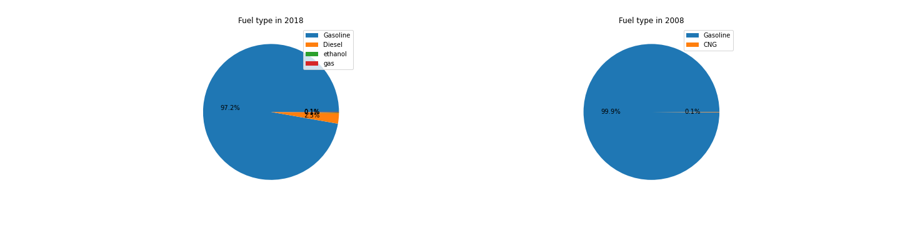
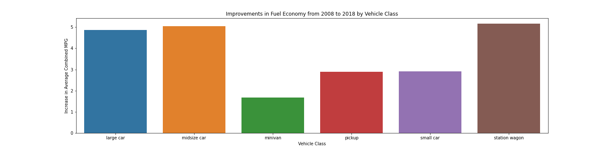

### table of contante 
    1. project description 
    2. dataset overview 
    3. data cleaning 
    4. key finding 

# preject name : fuel econamy analysis [2008-2018]
### 1.Project description : 

### 2.Dataset overview :
1.dataset download scource :
2.dataset elements
    
3.Using Documentation to Understand Data
 1. What is the unit of measure for engine displacement? Liters
 2. Match the meaning for each feature.
     * Stnd : Vehicle emissions standard code
     * Cyl : Number of Cylinders in the engine
     * Trans : Transmission Type
     * Drv : Drive Axle Type
        
### 3.Data cleaning :
 1. coloum renaming :
     * rename the coloum " " ot " " for better understanding of the dataset 
 2. reduce the dimensonality( remove the unimportant coloums ).
    * removed  'Stnd', 'Underhood ID', 'FE Calc Appr', 'Unadj Cmb MPG' fron 2008 dataset 
    * remove 'Stnd', 'Stnd Description', 'Underhood ID', 'Comb CO2' from 2018
 3. filter the data :
     * filte out all the data that only belong California('CA')
 4. fixing duplicate data .
 5. removing null .
 6. fixing data type
     * Fix cyl datatype 2008: extract int from string. 2018: convert float to int.
     * Fix air_pollution_score datatype 2008: convert string to float. 2018: convert int to float.
     * Fix city_mpg, hwy_mpg, cmb_mpg datatypes 2008 and 2018: convert string to float.
     * Fix greenhouse_gas_score datatype 2008: convert from float to int.
 7. remove all the unnesessary expresons
     * remove '/' from fuel 
     * resolve mistake like unintensional spacing 
# Data exploring with Visuals
### heigh-level overview of data 

### data distribution of 2008 fuel economy dataset 

### heigh-level overview of data 

### data distribution of 2018 fuel economy dataset 

# key finding 
1. Are more models using alternative sources of fuel? By how much?

2. How much have vehicle classes improved in fuel economy?
   

1. What are the characteristics of SmartWay vehicles?
2. Are smartway  vehicle are more eco-friendly ? 

