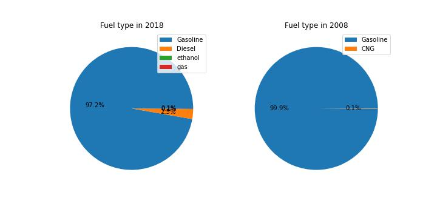
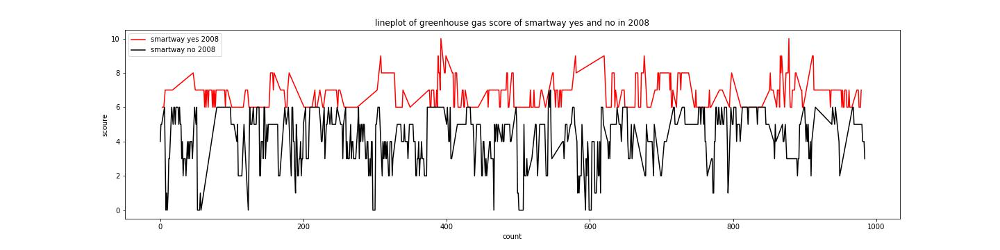

### table of contante 
    1. project description 
    2. dataset overview 
    3. data cleaning 
    4. key findings and conclusion 

# Project name: Fuel economy analysis [2008-2018]
---
### 1.Project description : 
---

This project is to find out and analyse the fuel economy in California.

<b> *  Q1: Are more unique models using alternative fuels in 2018 compared to 2008? By how much?
  
* Q2: How much have vehicle classes improved in fuel economy (increased in mpg)?
* Q3: What are the characteristics of SmartWay vehicles? Have they changed over time? (mpg, greenhouse gas)
* Q4: What features are associated with better fuel economy (mpg)?
* Q5:For all of the models that were produced in 2008 that are still being produced in 2018, how much has the mpg improved and which vehicle improved the most?
* Q6:Are SmartWay vehicles more eco-friendly?
* Q7:What is the correlation between displacement and combined mpg

</b>

### 2.Dataset overview :
---
Fuel Economy Data, The U.S. Environmental Protection Agency, provides this information, Office of Mobile Sources, National Vehicle and Fuel Emissions Laboratory. Note that the datasets we'll work with are slightly simpler than those found through the links below.

    * EPA Fuel Economy Testing:https://www.epa.gov/compliance-and-fuel-economy-data/data-cars-used-testing-fuel-economy

    * DOE Fuel Economy Data: https://www.fueleconomy.gov/feg/download.shtml/ For a better understanding of the dataset, you can refer to the Green Vehicle Guide Documentation and data description
  

    
 Using Documentation to Understand Data
 1. What is the unit of measure for engine displacement? Litres
 2. Match the meaning for each feature.
     * <b>Stnd</b>: Vehicle emissions standard code
     * <b>Cyl</b>: Number of Cylinders in the engine
     * <b>Trans</b>: Transmission Type
     * <b>Drv</b>: Drive Axle Type
     * <b>Mpg</b>: mile per gallon 
        
### 3.Data cleaning :
------------
 1. <b>column renaming</b>   :
     * rename the column " " to " " for a better understanding of the dataset 
 2. <b>reduce the dimensionality( remove the unimportant columns )</b>.
    * removed  ' Stnd', 'Underhood ID', 'FE Calc Appr', 'Unadj Cmb MPG' from 2008 dataset 
    * remove 'Stand', 'Stand Description', 'Underhood ID', 'Comb CO2' from 2018
 3. <b>filter the data</b> :
     * filter out all the data that only belong to California('CA')
 4. <b>Fix duplicate data</b>.
 5. <b>removing null</b>.
 6. <b>fixing data type </b>
     * Fix cyl datatype 2008: extract it from the string. 2018: convert float to int.
     * Fix air_pollution_score datatype 2008: convert string to float. 2018: convert int to float.
     * Fix city_mpg, hwy_mpg, cmb_mpg datatypes 2008 and 2018: convert string to float.
     * Fix greenhouse_gas_score datatype 2008: convert from float to int.
 7. <b>remove all the unnecessary expressions</b>
     * remove '/' from the fuel 
     * resolve mistakes like unintentional spacing 
### Data exploring with Visuals
-------------
### heigh-level overview of data 

### data distribution of the 2008 fuel economy dataset 

### heigh-level overview of data 

### data distribution of the 2018 fuel economy dataset 

### key finding 
---
### 1. <b>Are more models using alternative fuel sources? By how much?</b>

-->from the fig above, we can conclude that the percentage of alternative fuel sources are very very low, but it's increasing. 
### 2. How much have vehicle classes improved in fuel economy?
   

### 3. What are the characteristics of SmartWay vehicles?

### 4: What features are associated with better fuel economy?
features are associated with better fuel economy for year 2008 

features are associated with better fuel economy for the year 2018

### 5. Are SmartWay vehicles more eco-friendly? 

-->from the graph, we can easily conclude that the avg greenhouse gas score from both years for SmartWay vehicles is much higher in consideration to non-SmartWay vehicles ans is "no".

### 6. what is the underline correlation between displacement and combined mpg?

From the graph above, we can say there is a strong negative correlation between displacement and combined mpg.

