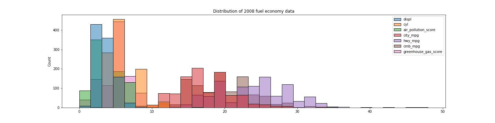

### table of contante 
    1. project description 
    2. dataset overview 
    3. data cleaning 
    4. key finding 

# Project name: Fuel economy analysis [2008-2018]
---
### 1.Project description : 
---
This project is for find out and analys the fule economy . in this project i try to demonstarate verious relasonship and some key finding 

### 2.Dataset overview :
---
Fuel Economy Data This information is provided by the U.S. Environmental Protection Agency, Office of Mobile Sources, National Vehicle and Fuel Emissions Laboratory. Note that the datasets we'll be working with are slightly simpler than those found through the links below.

    * EPA Fuel Economy Testing :https://www.epa.gov/compliance-and-fuel-economy-data/data-cars-used-testing-fuel-economy

    * DOE Fuel Economy Data : https://www.fueleconomy.gov/feg/download.shtml/ For better understanding of the dataset, you can refer the Green Vehicle Guide Documentation and data description
  

    
1. Using Documentation to Understand Data
 1. What is the unit of measure for engine displacement? Litres
 2. Match the meaning for each feature.
     * <b>Stnd</b>: Vehicle emissions standard code
     * <b>Cyl</b>: Number of Cylinders in the engine
     * <b>Trans</b>: Transmission Type
     * <b>Drv</b>: Drive Axle Type
     * <b>Mpg</b>: mile per gallon 
        
### 3.Data cleaning :
------------
 1. <b>column renaming</b>   :
     * rename the column " " to " " for a better understanding of the dataset 
 2. <b>reduce the dimensionality( remove the unimportant columns )</b>.
    * removed  ' Stnd', 'Underhood ID', 'FE Calc Appr', 'Unadj Cmb MPG' from 2008 dataset 
    * remove 'Stnd', 'Stnd Description', 'Underhood ID', 'Comb CO2' from 2018
 3. <b>filter the data</b> :
     * filter out all the data that only belong to California('CA')
 4. <b>Fix duplicate data</b>.
 5. <b>removing null</b>.
 6. <b>fixing data type </b>
     * Fix cyl datatype 2008: extract int from the string. 2018: convert float to int.
     * Fix air_pollution_score datatype 2008: convert string to float. 2018: convert int to float.
     * Fix city_mpg, hwy_mpg, cmb_mpg datatypes 2008 and 2018: convert string to float.
     * Fix greenhouse_gas_score datatype 2008: convert from float to int.
 7. <b>remove all the unnecessary expressions</b>
     * remove '/' from the fuel 
     * resolve mistakes like unintentional spacing 
# Data exploring with Visuals
-------------
### heigh-level overview of data 

### data distribution of the 2008 fuel economy dataset 

### heigh-level overview of data 

### data distribution of the 2018 fuel economy dataset 

# key finding 
---
### 1. <b>Are more models using alternative fuel sources? By how much?</b>

### 2. How much have vehicle classes improved in fuel economy?
   

### 3. What are the characteristics of SmartWay vehicles?

### 4. Are smartway vehicles more eco-friendly? 

